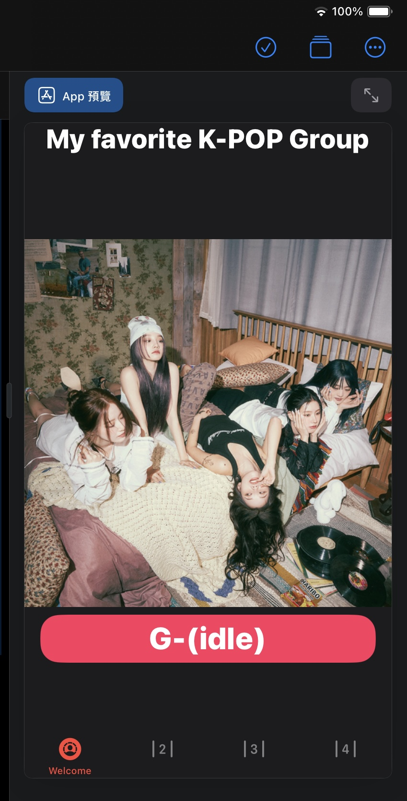
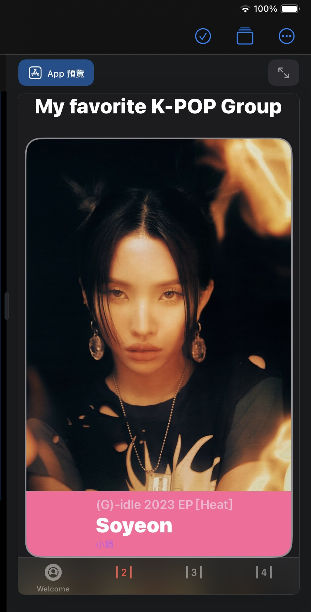
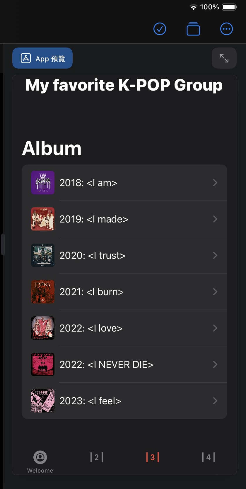
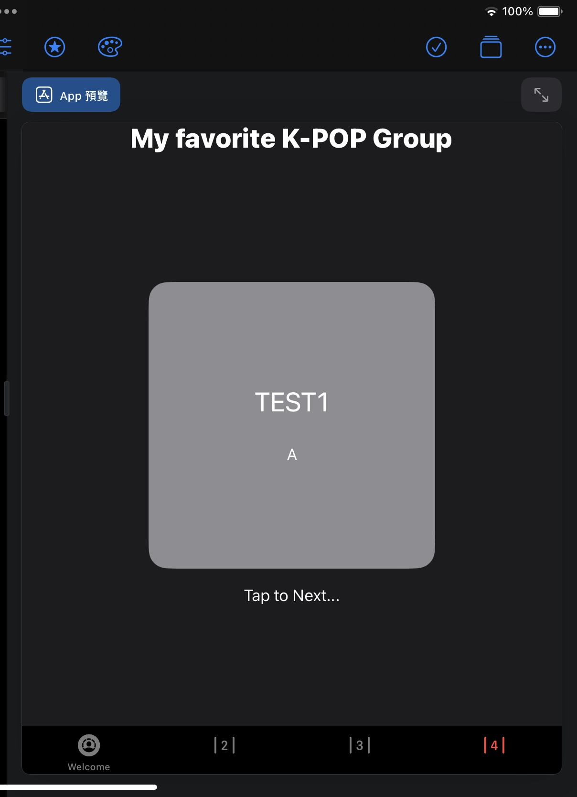

<h1>HW4—contentView</h1> 
<table>
  <tr>
      <td>
        
        
        
        
      </td>
  </tr>
  

```swift
  import SwiftUI
struct Gidle :Identifiable{
    var id = UUID()
    var img:String
    var opt:String
    var NameUS:String
    var NameCN:String
}
struct page3 :Identifiable{
    var id = UUID()
    var name:String
    var img:String
}
var Heat = [
    Gidle(img:"Soyeon",opt:"(G)-idle 2023 EP [Heat]", NameUS:"Soyeon",NameCN:"小娟"),
    Gidle(img:"Miyeon",opt:"(G)-idle 2023 EP [Heat]", NameUS:"Miyeon",NameCN:"薇娟"),
    Gidle(img:"Minnie",opt:"(G)-idle 2023 EP [Heat]", NameUS:"Minnie",NameCN:"米妮"),
    Gidle(img:"Yuqi",opt:"(G)-idle 2023 EP [Heat]", NameUS:"Yuqi",NameCN:"雨琦"),
    Gidle(img:"Shuhua",opt:"(G)-idle 2023 EP [Heat]", NameUS:"Shuhua",NameCN:"舒華"),
    
]

var album = [
    page3(name: "2018: <I am>", img: "Iam"),
    page3(name: "2019: <I made>", img: "Imade"),
    page3(name: "2020: <I trust>", img: "Itrust"),
    page3(name: "2021: <I burn>", img: "Iburn"),
    page3(name: "2022: <I love>", img: "Ilove"),
    page3(name: "2022: <I NEVER DIE>", img: "Ineverdie"),
    page3(name: "2023: <I feel>", img: "Ifeel")
]

struct BasicImageRow: View{
    var thisalbum:page3
    var body: some View{
        HStack{
            Image(thisalbum.img)
                .resizable()
                .frame(width: 40,height: 40)
                .cornerRadius(5)
            Text(thisalbum.name)
        }
    }
}
struct ListDetail:View{
    var thisalbum:page3
    var body: some View{
        VStack{
            Image(thisalbum.img)
                .resizable()
                //.frame(width: 40,height: 40)
                .aspectRatio(contentMode: .fit)
                //.cornerRadius(5)
                .clipped()
            Text(thisalbum.name)
                .font(.system(.title, design: .rounded))
                .fontWeight(.black)
            Spacer()
        }
    }
}

struct ContentView: View {
    var body: some View {
        VStack {
            
            Text("My favorite K-POP Group")
                .font(.title)
                .fontWeight(.heavy)
                .foregroundStyle(.primary)
            TabView{
                Group{
                    WelcomeView()
                        .tabItem { 
                            Image(systemName: "person.crop.circle.dashed.circle.fill")
                            Text("Welcome")
                        }
                    //Text("Page1.")
                    //.tabItem { 
                    //Image("")
                    //Image(systemName: "1.lane")
                    //Text("1")
                    //}
                    ScrollView{
                        ForEach(Heat){
                            thisHeat in           
                            CardView(img:thisHeat.img,Option:thisHeat.opt, NameUS: thisHeat.NameUS, NameCN: thisHeat.NameCN)
                        }
                    }
                    .tabItem { 
                        //Image("")
                        Image(systemName: "2.lane")
                        //  Text("2")
                    }
                    NavigationView{
                        List(album){albitem in
                            //BasicImageRow(thisalbum: albitem)}
                            NavigationLink(
                                destination: ListDetail(thisalbum: albitem),
                                label: {BasicImageRow(thisalbum: albitem)
                                })
                        }
                            .navigationBarTitle("Album")}
                    }
                    .tabItem { Image(systemName: "3.lane") }
                    TAPCardView()
                        .tabItem { Image(systemName: "4.lane") }
                   // SettingView()
                    .tabItem { Image(systemName: "slider.horizontal.3") }
                        .toolbarBackground(.black, for: .tabBar)   
                        .toolbarBackground(.visible, for: .tabBar)
                    //.toolbarColorScheme(.light, for:.tabBar)
                }
                .tint(.red)
            }
        }
    }

```
</table>
