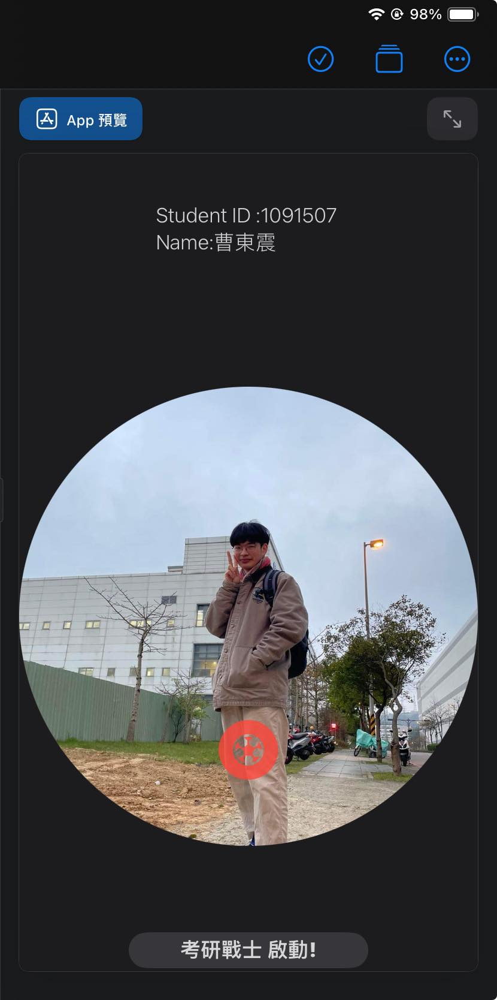

<h1>HW1</h1>
<table>
  <tr>
      <td>
        
      </td>
  </tr>
  

```swift
import SwiftUI

struct ContentView: View {
    var body: some View {
        Text("Student ID :1091507 \nName:曹東震")
            .fontWeight(.light)
            .frame(width: 200, height: 120, alignment: .center)
            //.background(.gray)
            .cornerRadius(20, antialiased: /*@START_MENU_TOKEN@*/true/*@END_MENU_TOKEN@*/)
            .opacity(/*@START_MENU_TOKEN@*/0.8/*@END_MENU_TOKEN@*/)
               Image("Handsome boy")
               .resizable()
               .aspectRatio(contentMode: .fit)
               .foregroundColor(.accentColor)
               .clipShape(/*@START_MENU_TOKEN@*/Circle()/*@END_MENU_TOKEN@*/, style: /*@START_MENU_TOKEN@*/FillStyle()/*@END_MENU_TOKEN@*/)
               .overlay(Image(systemName: "soccerball.circle.fill.inverse")
                .foregroundColor(.red)
                .frame(width: /*@START_MENU_TOKEN@*/100/*@END_MENU_TOKEN@*/, height:280, alignment: .bottom)
                .font(.system(size:50))
                .opacity(0.8)
       )
               Text("考研戰士 啟動!")
                    .fontWeight(.heavy)
                    
                    .frame(width: 200, height: 30, alignment: .center)
                    .background(.gray.opacity(0.3))
                    .cornerRadius(20, antialiased:true)
                    .opacity(0.8)
                
        
    }
}
  
```
</table>
